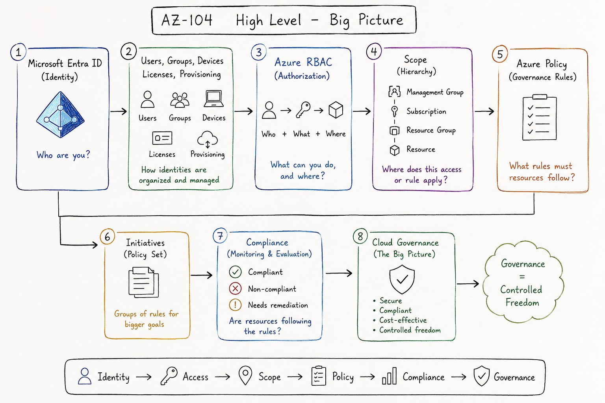

# AZ-104 — Manage Identities and Governance in Azure



## Big Picture

The whole module is trying to answer one main question:

**How do you manage an Azure environment securely and in an organized way?**

In other words:

**Who can access Azure?**  
**What can they do?**  
**Where can they do it?**  
**What rules must they follow?**

---

## 1. Microsoft Entra ID = Identity

The first layer is identity.

Microsoft Entra ID is the place that contains:

- Users
- Groups
- Devices
- Applications

Its main purpose is:

**To prove who you are.**

Before you give anyone permissions in Azure, that person needs an identity in Microsoft Entra ID.

The core idea:

```text
Microsoft Entra ID = Who are you?
```

---

## 2. Users, Groups, Devices = Organizing Identities

After understanding that Microsoft Entra ID is the place for identities, we need to organize those identities.

- Users = people
- Groups = collections of users for easier management
- Devices = the devices users sign in from
- Licenses = the services assigned to users
- Provisioning = automatic creation, update, and deletion of accounts

The main idea here:

**Instead of managing every user manually, you build an organized and scalable identity system.**

Simple example:

```text
A new employee joins the company
→ their account is created
→ they are added to the correct group
→ they receive the correct license
→ they receive the correct access
→ when they leave the company, their access is removed
```

---

## 3. Azure RBAC = Authorization

After identity comes the second question:

**What can this person do inside Azure?**

This is where Azure RBAC comes in.

Azure RBAC connects:

```text
Who + What + Where
```

Meaning:

- Who?
- What permission?
- At which scope?

Example:

```text
Ali
Contributor
On a specific Resource Group
```

The core idea:

```text
Azure RBAC = What can you do, and where?
```

---

## 4. Scope = Where Permissions and Rules Apply

Azure is organized as a hierarchy:

```text
Management Group
Subscription
Resource Group
Resource
```

These levels are important because you apply the following to them:

- RBAC
- Policy
- Governance

If you assign permissions at the Subscription level, they apply to everything under it.

If you assign permissions at the Resource Group level, they stay limited to that Resource Group.

The core idea:

```text
Scope = Where does this access or rule apply?
```

---

## 5. Azure Policy = Governance Rules

Even if someone has permission, that does not mean they can do anything without restrictions.

Example:

A user has permission to create a VM.

But the company says:

- Only create resources in approved regions
- Do not use expensive VM sizes
- Do not create resources without tags
- Do not open public access randomly

This is where Azure Policy comes in.

The core idea:

```text
Azure Policy = What rules must resources follow?
```

RBAC asks:

**Are you allowed to perform this action?**

Policy asks:

**Is the resource you want to create compliant with company rules?**

---

## 6. Initiatives = A Group of Policies for One Goal

One Policy = one rule.

One Initiative = a group of rules for a bigger goal.

Example:

A Security Baseline Initiative can include several rules:

- Require tags
- Require diagnostics
- Restrict regions
- Enforce encryption
- Audit insecure settings

The core idea:

```text
Initiative = Policy package for a bigger governance goal
```

---

## 7. Compliance = Is the Environment Following the Rules?

After policies are applied, Azure starts evaluating resources:

- Are they compliant?
- Are they non-compliant?
- Do they need remediation?
- Is there an exemption?

The core idea:

```text
Compliance = Are we following the rules?
```

---

## 8. Cloud Governance = The Complete Management Picture

Cloud Governance is the layer that brings everything together.

Its goal is:

To allow teams to work quickly,  
but within safe and organized boundaries.

It is not only about blocking actions.  
It is about organizing the environment.

```text
Governance = controlled freedom
```

The company wants to say:

Yes, teams can use Azure,  
but within clear rules,  
with defined permissions,  
controlled costs,  
strong security,  
and measurable compliance.

---

## Final Map

```text
Microsoft Entra ID
= Who are you?

Users / Groups / Devices / Licenses
= How identities are organized and managed

Azure RBAC
= What can you do?

Scope
= Where can you do it?

Azure Policy
= What rules must be followed?

Initiatives
= Groups of rules for bigger goals

Compliance
= Are resources following the rules?

Governance
= The full control system for Azure
```

---

## Golden Sentence

The whole module says:

**Azure Administration is not only about creating resources.**

It is about:

**Managing identity, permissions, scopes, policies, and compliance so that the Azure environment is secure, organized, and manageable.**

Or in the simplest form:

```text
Identity → Access → Scope → Policy → Compliance → Governance
```
